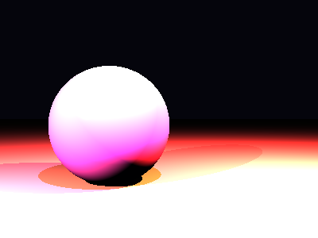

# Propriedades da Simulação


## Valores usados (numéricos)

```json
{
  "sphere": {
    "center": [
      -0.8344953869020673,
      -0.10824263556187064,
      0.0
    ],
    "radius": 1.0173937292705146
  },
  "plane": {
    "y": -1.0816523441349783,
    "normal": [
      0.0,
      1.0,
      0.0
    ]
  },
  "material_sphere": {
    "ambient": [
      0.028165647760033607,
      0.0009932095417752862,
      0.0769289955496788
    ],
    "diffuse": [
      0.8711241483688354,
      0.14781421422958374,
      0.7528669238090515
    ],
    "specular": [
      0.9828214049339294,
      0.2605993151664734,
      0.5500077605247498
    ],
    "shininess": 139.26289429346602
  },
  "material_plane": {
    "ambient": [
      0.07024547457695007,
      0.07235275954008102,
      0.056723546236753464
    ],
    "diffuse": [
      0.7577780485153198,
      0.22849933803081512,
      0.34087836742401123
    ],
    "specular": [
      0.07329902052879333,
      0.45385342836380005,
      0.09914225339889526
    ],
    "shininess": 24.213460240478067
  },
  "lights": [
    {
      "pos": [
        -4.140565886502382,
        2.513234166268057,
        5.469726478466784
      ],
      "power": [
        170.3765869140625,
        224.552978515625,
        120.21000671386719
      ]
    },
    {
      "pos": [
        1.2559200459086597,
        6.517196572164646,
        5.217253388422218
      ],
      "power": [
        174.99574279785156,
        102.65508270263672,
        164.1267547607422
      ]
    },
    {
      "pos": [
        3.476985303148618,
        3.8536181920742187,
        1.944509180156662
      ],
      "power": [
        292.6986999511719,
        171.6389617919922,
        50.93345642089844
      ]
    }
  ]
}
```

## O que significa cada valor (explicação para leigos)

- **Esfera - `center`**: posição da esfera no espaço 3D. Ex.: `[x, y, z]` — move a esfera para a esquerda/direita, para cima/baixo ou para frente/trás.
- **Esfera - `radius`**: tamanho da esfera; quanto maior, mais volumosa ela aparece na imagem.
- **Plano - `y`**: altura do piso. Valores menores (mais negativos) colocam o plano mais abaixo; valores próximos de zero posicionam o piso próximo da origem.
- **Material - `ambient`**: cor que representa a iluminação ambiente geral — pequena quantidade que ilumina objetos mesmo quando não recebem luz direta. É um componente suave e difuso.
- **Material - `diffuse`**: cor principal do objeto sob luz direta. Controla a aparência básica (por exemplo, azul, verde, vermelho).
- **Material - `specular`**: cor e intensidade dos brilhos (reflexos pequenos). Valores maiores tornam o brilho mais aparente.
- **Material - `shininess`**: controla o tamanho e nitidez do brilho especular. Valores altos produzem brilhos pequenos e intensos (superfícies muito brilhantes); valores baixos produzem brilhos largos e suaves (superfícies foscas).
- **Luzes - `pos`**: posição da fonte de luz no espaço; deslocar a luz muda a direção das sombras e onde aparecem os brilhos.
- **Luzes - `power`**: intensidade da luz por canal (R,G,B). Valores maiores tornam a cena mais iluminada; diferenças entre R/G/B podem dar tons coloridos à iluminação.

> Dica: experimente aumentar o `power` de uma luz para ver sombras mais claras, ou aumentar `shininess` da esfera para ver reflexos mais nítidos.