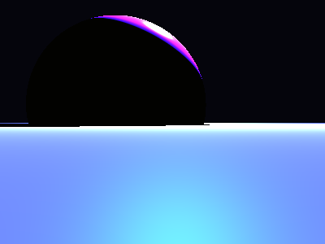

# Propriedades da Simulação


## Valores usados (numéricos)

```json
{
  "sphere": {
    "center": [
      -0.7241066373025604,
      0.27578635914497585,
      0.0
    ],
    "radius": 1.4473467562734492
  },
  "plane": {
    "y": -0.03804983582499388,
    "normal": [
      0.0,
      1.0,
      0.0
    ]
  },
  "material_sphere": {
    "ambient": [
      0.09003898501396179,
      0.08352535963058472,
      0.02814825437963009
    ],
    "diffuse": [
      0.32075047492980957,
      0.05895168334245682,
      0.9666483998298645
    ],
    "specular": [
      0.40466850996017456,
      0.8014039993286133,
      0.5570343732833862
    ],
    "shininess": 105.95764872848765
  },
  "material_plane": {
    "ambient": [
      0.010518252849578857,
      0.027903009206056595,
      0.02542443387210369
    ],
    "diffuse": [
      0.3130672574043274,
      0.48500436544418335,
      0.44324323534965515
    ],
    "specular": [
      0.002300821477547288,
      0.15183937549591064,
      0.003166735637933016
    ],
    "shininess": 23.718427535175422
  },
  "lights": [
    {
      "pos": [
        0.31379953863118004,
        2.5312138372064745,
        -0.6250993373237832
      ],
      "power": [
        125.83905792236328,
        99.43067932128906,
        224.3290557861328
      ]
    }
  ]
}
```

## O que significa cada valor (explicação para leigos)

- **Esfera - `center`**: posição da esfera no espaço 3D. Ex.: `[x, y, z]` — move a esfera para a esquerda/direita, para cima/baixo ou para frente/trás.
- **Esfera - `radius`**: tamanho da esfera; quanto maior, mais volumosa ela aparece na imagem.
- **Plano - `y`**: altura do piso. Valores menores (mais negativos) colocam o plano mais abaixo; valores próximos de zero posicionam o piso próximo da origem.
- **Material - `ambient`**: cor que representa a iluminação ambiente geral — pequena quantidade que ilumina objetos mesmo quando não recebem luz direta. É um componente suave e difuso.
- **Material - `diffuse`**: cor principal do objeto sob luz direta. Controla a aparência básica (por exemplo, azul, verde, vermelho).
- **Material - `specular`**: cor e intensidade dos brilhos (reflexos pequenos). Valores maiores tornam o brilho mais aparente.
- **Material - `shininess`**: controla o tamanho e nitidez do brilho especular. Valores altos produzem brilhos pequenos e intensos (superfícies muito brilhantes); valores baixos produzem brilhos largos e suaves (superfícies foscas).
- **Luzes - `pos`**: posição da fonte de luz no espaço; deslocar a luz muda a direção das sombras e onde aparecem os brilhos.
- **Luzes - `power`**: intensidade da luz por canal (R,G,B). Valores maiores tornam a cena mais iluminada; diferenças entre R/G/B podem dar tons coloridos à iluminação.

> Dica: experimente aumentar o `power` de uma luz para ver sombras mais claras, ou aumentar `shininess` da esfera para ver reflexos mais nítidos.