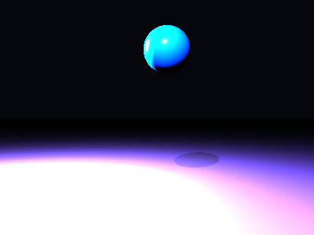

# Propriedades da Simulação


## Valores usados (numéricos)

```json
{
  "sphere": {
    "center": [
      0.174711159789684,
      1.196141993603656,
      0.0
    ],
    "radius": 0.41302797351058995
  },
  "plane": {
    "y": -1.6394435865103487,
    "normal": [
      0.0,
      1.0,
      0.0
    ]
  },
  "material_sphere": {
    "ambient": [
      0.09101533144712448,
      0.02230105549097061,
      0.026242196559906006
    ],
    "diffuse": [
      0.014519102871418,
      0.4521156847476959,
      0.8244797587394714
    ],
    "specular": [
      0.33179590106010437,
      0.9350487589836121,
      0.5734803676605225
    ],
    "shininess": 34.79304292984121
  },
  "material_plane": {
    "ambient": [
      0.03372127562761307,
      0.08178067952394485,
      0.078825443983078
    ],
    "diffuse": [
      0.4767102301120758,
      0.295993834733963,
      0.46660351753234863
    ],
    "specular": [
      0.07916056364774704,
      0.17603233456611633,
      0.40587082505226135
    ],
    "shininess": 49.24325419239131
  },
  "lights": [
    {
      "pos": [
        -1.1026028199514268,
        3.8564858901972587,
        5.680294870729451
      ],
      "power": [
        109.96691131591797,
        100.20526885986328,
        288.01605224609375
      ]
    },
    {
      "pos": [
        -3.2698491398763023,
        2.27672780496405,
        -1.2826773609147413
      ],
      "power": [
        111.9859619140625,
        135.97463989257812,
        222.4476776123047
      ]
    }
  ]
}
```

## O que significa cada valor (explicação para leigos)

- **Esfera - `center`**: posição da esfera no espaço 3D. Ex.: `[x, y, z]` — move a esfera para a esquerda/direita, para cima/baixo ou para frente/trás.
- **Esfera - `radius`**: tamanho da esfera; quanto maior, mais volumosa ela aparece na imagem.
- **Plano - `y`**: altura do piso. Valores menores (mais negativos) colocam o plano mais abaixo; valores próximos de zero posicionam o piso próximo da origem.
- **Material - `ambient`**: cor que representa a iluminação ambiente geral — pequena quantidade que ilumina objetos mesmo quando não recebem luz direta. É um componente suave e difuso.
- **Material - `diffuse`**: cor principal do objeto sob luz direta. Controla a aparência básica (por exemplo, azul, verde, vermelho).
- **Material - `specular`**: cor e intensidade dos brilhos (reflexos pequenos). Valores maiores tornam o brilho mais aparente.
- **Material - `shininess`**: controla o tamanho e nitidez do brilho especular. Valores altos produzem brilhos pequenos e intensos (superfícies muito brilhantes); valores baixos produzem brilhos largos e suaves (superfícies foscas).
- **Luzes - `pos`**: posição da fonte de luz no espaço; deslocar a luz muda a direção das sombras e onde aparecem os brilhos.
- **Luzes - `power`**: intensidade da luz por canal (R,G,B). Valores maiores tornam a cena mais iluminada; diferenças entre R/G/B podem dar tons coloridos à iluminação.

> Dica: experimente aumentar o `power` de uma luz para ver sombras mais claras, ou aumentar `shininess` da esfera para ver reflexos mais nítidos.