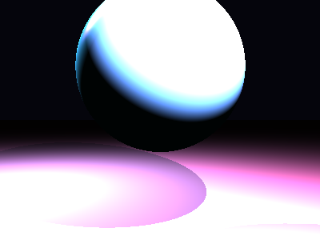

# Propriedades da Simulação


## Valores usados (numéricos)

```json
{
  "sphere": {
    "center": [
      0.006651947832073901,
      0.8628948244215717,
      0.0
    ],
    "radius": 1.4070251692314022
  },
  "plane": {
    "y": -1.98028915492187,
    "normal": [
      0.0,
      1.0,
      0.0
    ]
  },
  "material_sphere": {
    "ambient": [
      0.02846408076584339,
      0.12223398685455322,
      0.1314489245414734
    ],
    "diffuse": [
      0.22539187967777252,
      0.7486996054649353,
      0.9807833433151245
    ],
    "specular": [
      0.6235151886940002,
      0.31431135535240173,
      0.9372637271881104
    ],
    "shininess": 64.65830204007594
  },
  "material_plane": {
    "ambient": [
      0.07978218793869019,
      0.044831566512584686,
      0.044861771166324615
    ],
    "diffuse": [
      0.787992000579834,
      0.589411735534668,
      0.8789157867431641
    ],
    "specular": [
      0.49283352494239807,
      0.0778052881360054,
      0.19830185174942017
    ],
    "shininess": 48.60975050479078
  },
  "lights": [
    {
      "pos": [
        -4.532268981616841,
        4.971635008506993,
        -2.84901902872996
      ],
      "power": [
        115.32470703125,
        106.13705444335938,
        114.99252319335938
      ]
    },
    {
      "pos": [
        1.4371051043508452,
        2.985395878179264,
        3.284187658141965
      ],
      "power": [
        168.15988159179688,
        77.51075744628906,
        98.60001373291016
      ]
    }
  ]
}
```

## O que significa cada valor (explicação para leigos)

- **Esfera - `center`**: posição da esfera no espaço 3D. Ex.: `[x, y, z]` — move a esfera para a esquerda/direita, para cima/baixo ou para frente/trás.
- **Esfera - `radius`**: tamanho da esfera; quanto maior, mais volumosa ela aparece na imagem.
- **Plano - `y`**: altura do piso. Valores menores (mais negativos) colocam o plano mais abaixo; valores próximos de zero posicionam o piso próximo da origem.
- **Material - `ambient`**: cor que representa a iluminação ambiente geral — pequena quantidade que ilumina objetos mesmo quando não recebem luz direta. É um componente suave e difuso.
- **Material - `diffuse`**: cor principal do objeto sob luz direta. Controla a aparência básica (por exemplo, azul, verde, vermelho).
- **Material - `specular`**: cor e intensidade dos brilhos (reflexos pequenos). Valores maiores tornam o brilho mais aparente.
- **Material - `shininess`**: controla o tamanho e nitidez do brilho especular. Valores altos produzem brilhos pequenos e intensos (superfícies muito brilhantes); valores baixos produzem brilhos largos e suaves (superfícies foscas).
- **Luzes - `pos`**: posição da fonte de luz no espaço; deslocar a luz muda a direção das sombras e onde aparecem os brilhos.
- **Luzes - `power`**: intensidade da luz por canal (R,G,B). Valores maiores tornam a cena mais iluminada; diferenças entre R/G/B podem dar tons coloridos à iluminação.

> Dica: experimente aumentar o `power` de uma luz para ver sombras mais claras, ou aumentar `shininess` da esfera para ver reflexos mais nítidos.